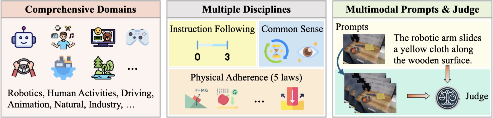

# WorldModelBenchmark

[**🌐 Homepage**](https://seerkfang.github.io/world-model-benchmark.github.io/) | [**🏆 Leaderboard**](https://seerkfang.github.io/world-model-benchmark.github.io/#leaderboard) | [**📖 WorldModelBench arXiv**](https://arxiv.org/pdf/2311.16502.pdf)

This repo contains the evaluation instructions for the paper "[WorldModelBench: Judging Video Generation Models As World Models](https://drive.google.com/drive/folders/1mBBGM1E14JlmXmqRFonlqs76d9uBBZ0T?usp=drive_link)".

## 🔔News

- **🔥[2025-02-23]: Our [WorldModelBench](https://seerkfang.github.io/world-model-benchmark.github.io/) is now available. We look forward to your participation! 😆**

## Introduction

### WorldModelBench

WorldModelBencha is a benchmark designed to evaluate the **world modeling capabilities** of video generation models across **7** application-driven domains (spanning from Robotics, Driving, Industry, Human Activities, Gaming, Animation, and Natural) and **56** subdomains. Each domain features 50 carefully curated prompts, comprising a text description and an initial video frame, tailored for video generation. We provide a **human-aligned** VLM (Vision-Language Model) based judger to automatically evaluate model-generated videos on **Instruction Following**, **Common Sense**, and **Physical Adherence**.



## Evaluation

🎯 Please refer to the following instructions to evaluate with WorldModelBench:
- **Environment Setup**: Clone and install VILA by following the instructions in [VILA Installation Guide](https://github.com/NVlabs/VILA?tab=readme-ov-file#installation).
- **Data&Model Preparation**: Download [WorldModelBench test set](https://huggingface.co/datasets/Efficient-Large-Model/worldmodelbench) and the [judge](https://huggingface.co/Efficient-Large-Model/vila-ewm-qwen2-1.5b) separately.
```
└── worldmodelbench
    └── images (first frames of videos)
    └── evaluation.py (evaluation script)
    └── worldmodelbench.json (test set)
    ...
```
The ```worldmodelbench.json``` has a list of dict containing instances for video generation.
```
[
  {
          "domain": "autonomous vehicle",
          "subdomain": "Stopping",
          "text_first_frame": "The autonomous vehicle approaches a traffic light on a bridge surrounded by tall buildings. Construction barriers line the sides of the bridge with a yellow traffic light visible ahead.",
          "text_instruction": "The autonomous vehicle stops at the traffic light on the bridge.",
          "first_frame": "images/69620089860948e38a4921dd4869d24f.jpg"
      }
...
]
```
- **Video Generation**: Perform video generation model inference. You will find 350 test instances in the worldmodelbench.json file. For *each instance*, follow the instructions below to generate the videos:
  - **Text-to-Video**: Use the following as the generation prompt: ```" ".join([instance["text_first_frame"], instance["text_instruction"]])```.
  - **Image-to-Video**: Use the following as the generation prompt: ```instance["first_frame"] + instance["text_instruction"]```.
**Note**: Please save the video using the **same name** as ```instance["first_frame"]```, replacing the file extension ```.jpg``` with ```.mp4```.
- **Evaluation**:
```
python evaluate.py --video_dir GENERATED_VIDEOS --judge PATH_TO_JUDGE --save_name RESULTS_FILE
```

The answers and explanations for the test set questions are withheld. You can [reach out](https://github.com/Seerkfang/WorldModelBenchmark#contact) to the organizers to submit your results for the leaderboard.

## Disclaimers
The guidelines for the annotators emphasized strict compliance with copyright and licensing rules from the initial data source, specifically avoiding materials from websites that forbid copying and redistribution. 
Should you encounter any data samples potentially breaching the copyright or licensing regulations of any site, we encourage you to [contact](#contact) us. Upon verification, such samples will be promptly removed.

## Contact
- Dacheng Li: dacheng177@berkeley.edu
- Yunhao Fang: yuf026@ucsd.edu
- Song Han: songhan@mit.edu
- Yao Lu: jasonlu@nvidia.com

## Citation

**BibTeX:**
```bibtex
@inproceedings{Li2024WorldModelBench,
  title={WorldModelBench: Judging Video Generation Models As World Models},
  author={Dacheng Li and Yunhao Fang and Yukang Chen and Shuo Yang and Shiyi Cao and Justin Wong and Xiaolong Wang and Hongxu Yin and Joseph E. Gonzalez and Ion Stoica and Song Han and Yao Lu},
  booktitle={In Submission},
  year={2025},
}
```
This website is website adapted from [MMMU](https://github.com/MMMU-Benchmark/MMMU).
